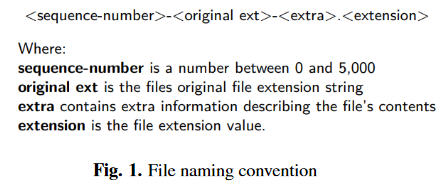
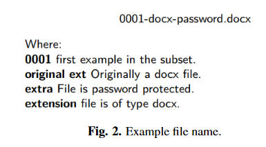
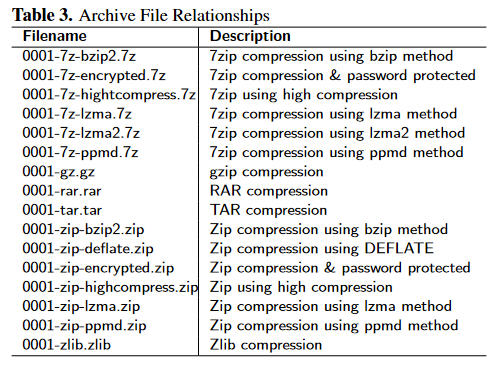
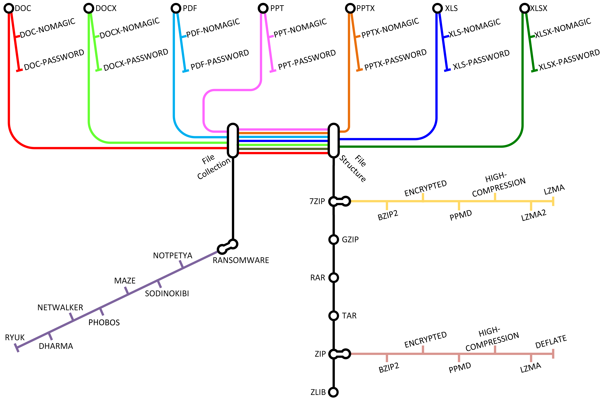

# NapierOne: A Modern Mixed File Data Set

# Table of contents
1. [Summary](#Summary)
2. [Data Sources](#DataSources)
    1. [File Selection](#FileSelection)
    2. [File Sources](#FileSources)
3. [Dataset Structure](#DatasetStructure)
    1. [File Name Convention](#FileNameConvention)
    2. [File Structure](#FileStructure)
    3. [File Collection](#FileCollection)
5. [Documentation](#Documentation)
6. [Tutorials](./tutorials.md)

## Summary 
A modern cybersecurity mixed file data set called ‘NapierOne’ is presented, primarily aimed at, but not limited to, ransomware detection and forensic analysis. NapierOne was designed to address the known deficiency in research reproducibility and improve consistency by facilitating research replication and repeatability. The methodology used in the creation of this data set is also described in detail. The data set was inspired by the Govdocs1 data set and it is intended that ‘NapierOne’ be used as a complement to this original data set.

An investigation was performed with the goal of determining the common files types currently in use. No specific research was found that explicitly provided this information, so an alternative consensus approach was employed. This involved combining the findings from multiple sources of file type usage into an overall ranked list. After which 5,000 real-world example files were gathered, and a specific data subset created, for each of the common file types identified. In some circumstances, multiple data subsets were created for a specific file type, each subset representing a specific characteristic for that file type. For example, there are multiple data subsets for the ZIP file type with each subset containing examples of a specific compression method. Ransomware execution tends to produce files that have high entropy, so examples of file types that naturally have this attribute are also present. The resulting entire data set comprises of more than 90 separate data subsets divided between 44 distinct file types, resulting in over 450,000 unique files in total.

## Data Sources
### File Selection
An important aspect of building a representative data set relates to file type usage and popularity. It is known that Google gathers statistics on file types while it performs its website indexing searches. However, the statistics are only gathered on a limited number of file types (https://
support.google.com/webmasters/answer/35287?hl=en http://
googlegsa.github.io/adaptor/index.html). 
While it was not possible to discover a definitive ranked list of files types currently in use, it was decided to adopt a consensus approach. This involved querying various sources of possible usage information and gathering approximate lists of up to their Top 40 file types. These lists were then compared and aggregated with the lists gathered from other sources, resulting in a fair representation of what are currently popular file types are in use today. The list produced is not proposed as definitive but rather a best guess consensus.
A list of the sources for file type usage information is discussed below. The alphabetical identification used for each data source is then repeated in the data set description shown in Table~\ref{tab:data-set-details}.

***A - VirusTotal*** Statistics taken from file submissions to this website~\cite{VirusTotal2019} during that past 12 months were recorded.

***B - W3Techs*** The website (http://w3techs.com/technologies/overview/) provides information about the usage of various types of technologies on the web. Statistics relating to the most popular images types were gathered from here.

***C - Search Engine Statistics*** Searches were performed for more than 100 different candidate file types. Search trends and statistics were also analysed and recorded in an attempt to identify the popularity of the file type. Although Google only index certain file types (https://
support.google.com/webmasters/answer/35287?hl=en), their justification for doing so could also be considered a reason to include these files types in the data set.

***D - File Preservation*** There exists research into the investigation of digital data preservation. One aspect of this research is to identify popular file formats. The findings from this research were also taken into account, as this research identifies certain files as being important and have the potential for remaining in active use for the foreseeable future.

***E - MIME Type Statistics*** A MIME type (https://www.doi.org/10.17487/RFC2046 https://www.doi.org/10.17487/RFC6838) is a standard label used to indicate the nature and format of a document, file, or assortment of bytes. It is mainly used in Internet-based technology so that software can know how to handle the data. It serves the same purpose on the Internet that file extensions do on Microsoft Windows. When crawling the internet, these labels may be recorded and the frequency of them can be used to identify the popularity of file formats. Statistics have thus been gained from the WayBackMachine (https://archive.org/web/) and for WebCrawler (https://commoncrawl.github.io/cc-crawl-statistics/plots/mimetypes), who record and publish monthly statistics on MIME types that are encountered.

***F - fileinfo.com*** This website (https://fileinfo.com/) performs research into file types and regularly publishes ranked lists of popular file types. These popularity lists are calculated from both the requests that the website receives and general web traffic analysis.

***G - Ransomware Targets*** One of the anticipated initial applications of this data set will be in the field of ransomware research. For the data set to be useful in this research, it should contain a good selection of file types that are regularly targeted by ransomware ( https://doi.org/10.1016/j.cose.2018.01.001 https://doi.org/10.1007/s00500-018-3257-z https://doi.ieeecomputersociety.org/10.1109/SANER.2017.7884603), typical examples of which being DOCX and XLSX. This additional criterion did not impact the main goal of listing common file types as these file types appear in multiple lists.

***H - High Entropy*** As the data set will initially be used in ransomware detection testing, it was considered a benefit for the data set to contain files that had this attribute. One technique used to identify files that have been affected by ransomware is to test the file's entropy so including files that normally have this attribute, such as archive files, would provide realistic challenges in ransomware identification. This secondary consideration does not impact the overall goal of generating the file type popularity list.

***I - File-extension*** These are others websites (https://www.file-extension.info/top  https://www.file-extension.org/ )specialising in file type research and regularly publish file type usage statistics.

***J - OS Installation*** File type count statistics were gathered from clean windows installations (XP 2003 SP1, Vista 2006 and Windows 10 20H2) as well as four clean 64Bit Linux installations (MX Linux 19.4, Debian 5.9.1, Ubuntu 18.04.1, and Ubuntu 20.10).

***K - Govdocs1*** Inclusion of the file types in the original Govdocs1 data set (https://digitalcorpora.org/corpora/files) were also taken into consideration when deciding if they should appear in this data set. However, the actual files being sourced from elsewhere.

The results for all the sources were then sorted by popularity and aggregated into a list of approximately 40 file types. To encourage consensus, the file types needed to appear in at least two lists before they were considered in the final results. The following list describes the file types that were identified as being popular using the infoirmation gathered from the sources above.

| &nbsp; | &nbsp; | &nbsp; | &nbsp; | &nbsp; |
| ------ | ------ | ------ | ------ | ------ | 
| APK    | BIN    | BMP    | CSS    | CSV    |     
| DOC    | DOCX   | DWG    | ELF    | EPS    |
| EPUB   | EXE    | GIF    | GZIP   | HTML   | 
| ICS    | JS     | JPG    | JSON   | MKV    | 
| MP3    | MP4    | ODS    | OXPS   | PDF    | 
| PNG    | PPT    | PPTX   | PS1    | RAR    |
| SVG    | TAR    | TIF    | TXT    | WEBP   | 
| XLS    | XLSX   | XML    | ZIP    | ZLIB   | 
|7Zip|||||

### File Sources 
The contents of the ***NapierOne*** new data set were generated in the following ways:
- Examples of files using the most commonly used document types such as DOC, DOCX, PDF, PPT, PPTX, XLS, and XLS  were be gathered from the UK government domain, ***gov.uk***. Files collected from this domain are covered by the 'Open Government License agreement for Public Sector Information' (http://www.nationalarchives.gov.uk/doc/open-government-licence/
version/3). This agreement allows for the free distribution of the documents as long as they are accompanied by the correct attribution.
- Image files in the TIF format were taken from the RAISE data set (https://doi.org/10.1145/2713168.2713194). This data set permits redistribution of its contents as long as it is accompanied by the correct attribution. Subsequent image file type data subsets, for example, BMP, EPS, GIF, ICO, JPG, PNG, SVG and WEBP were generated from this original TIF data set.
- Archive data subsets were generated using files from the documents subset.
- Audio files were gathered from the Free Music Archive (https://arxiv.org/abs/1612.01840). Its license permits free and unrestricted usage and distribution.
- Video files, in MP4, format, were gathered from the Kinetics-700 data set (https://arxiv.org/abs/2010.10864). Its license also allows free usage and distribution when using the correct attribution. Other video data sets in different formats were generated by transcoding this MP4 data set.
- Examples of files in the EPUB format were taken from Project Gutenberg (https://www.gutenberg.org), which is an online library of free eBooks.

# Dataset Details 
## File Name Convention <a name="FileNameConvention">
To provide consistency across the entire data set, a standardised naming convention was used. Reasons for renaming the files to follow this convention were: firstly the file names reflect to some extent the content and structure of the file itself and so are self-documenting. The renaming processes provides a small degree of anonymisation and finally, files containing related content are linked via their sequence numbers. A description of the file naming convention used is shown in Figure 1. The inclusion of the sequence number facilitates the possibility of being able to cross-reference certain related files across data subsets, such as in tracing image files or archives that use the same underlying content. The file's extension value appears as part of the file name, as well as the file's actual extension. It is in both places because in some cases, such as when a file is encrypted by ransomware, the actual extension is modified. In these circumstances, the file's original extension can still be seen from the file name. 

    
For example, for the first file in the DOCX data subset that has been password-protected, the name would be the value shown in Figure 2. 

    
Examples of how the sequence number is used to link related files are shown in Tables 2 and 3. 
    

    

    
The authors retain the ability to determine each file's original file name if required.
When renaming the files, a record is kept of the mapping between the original and new file names to allow the original name to be determined if required.

The files within the data set are organised by file type into a directory hierarchy. On the top level are the main file types, such as DOC, PPTX, ZIP, and so on. Below these main type classification directories are one or more subdirectories, one for each type of file format variation. For example, a BZIP directory containing files created using the bzip compression method of the ZIP program, would be found under the main zip directory. The directory structure of the data set can be deduced from Table~\ref{tab:data-set-details}. Contained within each directory that holds data, is a description file in both HTML and PDF formats, which describes the data held within that data subset. The description file includes amongst other things: a description of the data files, where the data was sourced, the licence details and contact information.

 ## File Structure <a name="FileStructure">   
Once the main data types had been collected, two additional actions were performed. Firstly a directory structure was generated where 5,000 subdirectories were created named from 0001 to 5000. Each of these subdirectories was then populated with examples from the document and image data subsets, resulting in each directory containing between 5 and 15 files of various types. The purpose of this file structure was to form a hierarchy that could be used when creating data subsets of archive file types. The following archive data subsets were then created by performing compression on this file structure: 7Zip, GZIP, RAR, TAR, Zip and ZLib. As these file formats tend to have high entropy, they will be useful in ransomware detection testing. For some file types, multiple data subsets were created allowing the option to represent different compression levels or compression techniques. Again the same naming convention was leveraged, so using the sequence number, individual-related archives can be linked together. For example, Table 3 shows the different archives that were generated from the source directory 0001. Unless otherwise stated, the compression tool's default values were used in the creation of the archives. 

 ## File Collection <a name="FileCollection">   
 A single, file collection, directory was created which contained examples of file types that are typically targeted by ransomware (https://doi.org/10.1016/j.cose.2018.01.001 https://doi.org/10.1007/s00500-018-3257-z https://doi.ieeecomputersociety.org/10.1109/SANER.2017.7884603). Examples of these file types being DOC, DOCX, PDF, PPT, PPTX, XLS and XLSX. This directory would act as a ransomware target directory and was placed on a previously prepared, isolated test machine, and a ransomware sample was executed in an ethical manner. Valid ransomware samples being sourced from VirusTotal~\cite{VirusTotal2019}. Once the ransomware execution had completed, the target files were examined to determine if they had been affected by the ransomware's execution. If they had, then, the affected files were checked for viruses and after confirming that they were safe, were placed in their own data subset within the ***NapierOne*** data set. Currently, data subsets of ransomware encrypted files have been created for the following ransomware strains: NotPetya; Sodinokibi; Maze; Phobos; Netwalker; Dharma; and Ryuk.

Again leveraging the sequence number, the target file and ransomware encrypted file can be connected. A graphical representation of the relationships between the documents data subsets and the file collection and file structure hierarchies is shown in Figure 4.
    

    
 An overall view of the provenance of the individual data subsets is shown below: 

    
As long as the attribution and license stipulations are followed, access to this ***NapierOne*** data set for research purposes is free and unrestricted. For access to the data set, visit www.napierone.com or alternatively contact the authors of this page.

It can be seen from that table xxx that some data subsets are extremely large, with the total uncompressed size of the entire data set is approaching 2TB. Due to its size, the data set has been broken down into smaller parts allowing the possibility to only access portions of the data set.
The final data set is broken down as follows.
- Each data subset is available in three separate archives.
    - ***Tiny*** This archive contains 100 examples of the specific file type. The actual files contained within this archive are the files of this type that have sequence numbers between 0001 and 0100.
    - ***Small*** This archive contains 1,000 examples of the specific file type. The actual files contained within this archive are the files of this type that have sequence numbers between 0001 and 1,000.
    - ***Total*** This archive contains all the examples of the specific file type present in the ***NapierOne*** data set.
 
- These individual archives have also been combined into three larger archives as described below:
    - ***NapierOne-Tiny*** This archive contains a copy of all the *Tiny* archives mentioned in the bullet point above.
    - ***NapierOne-Small*** This archive contains a copy of all the *Small* archives mentioned in the bullet point above.
    - ***NapierOne-Total*** This archive contains a copy of all the *Total* archives mentioned in the bullet point above. This archive is very large as it contains all the data from the ***NapierOne*** data set.
    
Each data set archive is accompanied by documentation providing the user with a detailed description of that particular archive including attribution and licensing instructions. Using this structured approach, researchers will be able to tune, what and how much they download, to their specific requirements. Password protected versions of document and archive files all use the same password, \emph{napierone}. 

When accessing the website some simple registration may be required. This was implemented to allow the authors to gather some basic usage information regarding the data set. Information gathered during the registration will be handled in accordance with GDPR regulations~\cite{Union2017}. The anonymised information gathered during the registration will allow the authors to monitor the use, application and adoption of the data set.
    

    
A full listing of the dataset structure can be found [Dataset Structure](./DatasetStructure.txt)
    

## Access <a name="Access">
    Need help from Amazon for this
    
# Documentation 
Documentation for this data set exists in three main areas
1. The github repository https://github.com/simonrdavies/NapierOne/blob/main/README.md
2. The journal paper published in xxxxx
3. Each data subset has associated with it, its own specific PDF documentation. This PDF is delivered together with the data subset. Contained within this document are specific details relating to that specific data subset. This includes a description of the data set, how the data within this specific data set was generated/gathered, contact information, license considerations and attibution information.

