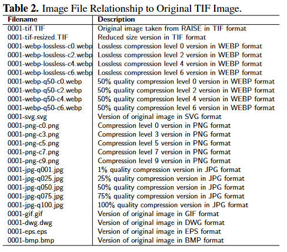
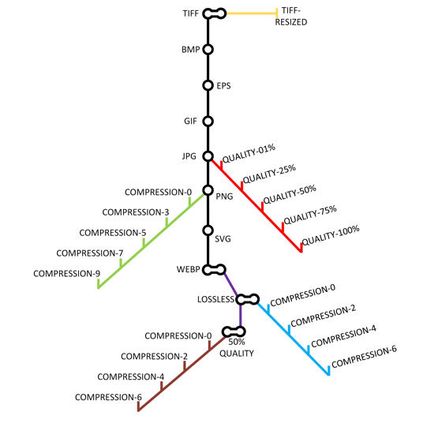

# Table of contents
1. [Compression analysis](#CompressionAnalysis)
2. [Encryption analysis](#EncryptionAnalysis)
3. [Password protection analysis](#PasswordProtectionAnalysis)
4. [Image encoding analysis](#ImageEncodingAnalysis)

# Compression analysis 
The following data subsets, present in the NapiertOne data set, are all examples of archive file formats: 7Zip, GZIP, TAR, RAR, ZIP and ZLIB.

All these archive data subsets were created from the same source folders. A consequence of this being that content of each archive data subset are related. The relation between these subsets can been determined via the sequence number specified in the data subset file name. For example,  the files in the data subset of 7Zip, GZIP,TAR, RAR, ZIP and ZLIB that have the sequence number 0001 were all created from the same source files, the same goes for sequence number 0002, 0003... and so on.

Due to this relationship, it is possible to compare the output from different archiving techniques by comparing archives files from different archive data subsets. As mentioned previously,  archives are linked using the sequence number.

For example the following data set files all contain archives of the same files, but were created using the different archiving methods.
|File Name | Data Set | Type | Comment|
|--------- | -------- | ---- | ------|
|0001-7z-bzip2.7Z         | BZIP2             | 7Zip| Created using the 7Zip tool, using BZIP2 compression|
|0001-7z-encrypted.7Z     | Password protected| 7Zip| Created using the 7Zip tool, encrypted using a password|
|0001-7z-highcompress.7Z  | High Compression  | 7Zip| Created using the 7Zip tool with high compression settings|
|0001-7z-lzma.7Z          | LZMA compression  | 7Zip| Created using the 7Zip tool, using LZMA compression |
|0001-7z-LZMA2.7Z         | LZMA2 compression | 7Zip| Created using the 7Zip tool, using LZMA2 compression |
|0001-7z-ppmd.7Z          | PPMD compression  | 7Zip| Created using the 7Zip tool, using PPMD compression |
|0001-gz.gz               | Gzip compression  | GZip| Created using the default configuration of Gzip tool|
|0001-rar.rar             | RAR archive       | RAR | Created using the default configuration of RAR. Archive but no compression|
|0001-tar.tar             | TAR archive       | TAR | Created using the default configuration of TAR. Archive but no compression|
|0001-zip-bzip2.zip       | BZIP2             | Zip | Created using the Zip tool, using BZIP2 compression|
|0001-zip-deflate.zip     | DEFLATE           | Zip | Created using the Zip tool, using DEFLATE compression|
|0001-zip-encrypted.zip   | Password protected| Zip | Created using the Zip tool, encrypted using a password|
|0001-zip-highcompress.zip| High Compression  | Zip | Created using the Zip tool with high compression settings|
|0001-zip-lzma.zip        | LZMA compression  | Zip | Created using the Zip tool, using LZMA compression |
|0001-zip-ppmd.zip        | PPMD compression  | Zip | Created using the Zip tool, using PPMD compression |
|0001-zlib.zlib           | Zlib              | Zlib | Created using the ZLIB tool and default values|

Data set properties such as file size, entropy, file contents and compression efficiency can then be analysed for each of the archiving techniques.

# Encryption analysis 
Typical examples of files that are commonly attacked by ransomware, were exposed to the following ransomware strains:
- Dharma
- Maze
- Netwalker
- NotPetya
- Phobos
- Ryuk
- Sodinokibi

This resulted in the generation of specific data subsets for each of these ransomware strains. Each data subset contains versions of files encrypted using the specific ransomware strain. Again the sequence number, combined with the file type, is used to link these various files together

So for example , considering the Microsoft Office word document NapierOne\DOC\DOC\0001-doc.doc, the following files are related

|File Name | Path              |  Comment|
|--------- | --------          | ------|
|0001-doc.doc|NapierOne\DOC\DOC| Original file|
|0001-doc.doc.id-0481FA80.[paymentbtc@firemail.cc].cmb |NapierOne\EXTRA\RANSOMWARE\DHARMA    | File encrypted using the DHARMA ransomware|
|0001-doc.doc.OVF1GDZ                                  |NapierOne\EXTRA\RANSOMWARE\MAZE      | File encrypted using the MAZE ransomware|
|0001-doc.doc.c924ca                                   |NapierOne\EXTRA\RANSOMWARE\NETWALKER | File encrypted using the NETWALKER ransomware|
|0001-doc.doc                                          |NapierOne\EXTRA\RANSOMWARE\NOTPETYA  | File encrypted using the NOTPETYA ransomware|
|0001-doc.doc.id[0481FA80-1096].[lockhelp@qq.com].acute|NapierOne\EXTRA\RANSOMWARE\PHOBOS    | File encrypted using the PHOBOS ransomware|
|0001-doc.doc.RYK                                      |NapierOne\EXTRA\RANSOMWARE\RYUK      | File encrypted using the RYUK ransomware|
|0001-doc.doc.wiyn0sx9jt                               |NapierOne\EXTRA\RANSOMWARE\SODINOKIBI| File encrypted using the SODINOKIBI ransomware|

As we have access to the original and the corresponding encrypted files, some examples of analysis could be:
- Content comparison between original and encrypted files
- Format and structure analysis of the encrypted file
- Possible key determination from the encrypted file
- Possible decryption of encrypted file

# Password protection analysis 
Microsoft Office format files present in the NapierOne data set include the following formats: DOC, DOCX, PPT, PPTX, XLS and XLSX
Copies of these files were then saved using the password protection functionality provided by Microsoft Office tools. The password being used was ***NapierOne***
Again these files were linked using the sequence number.

So for example:
- the file NapierOne\DOC\DOC\0001-doc.doc has the same content as the file NapierOne\DOC-PASSWORD\0001-doc-password.doc, except it is password protected (encrypted)
- the file NapierOne\DOCX\DOCX\0001-docx.docx has the same content as the file NapierOne\DOCX-PASSWORD\0001-docx-password.docx, except it is password protected (encrypted)
- the file NapierOne\PPT\PPT\0001-ppt.ppt has the same content as the file NapierOne\PPT-PASSWORD\0001-ppt-password.ppt, except it is password protected (encrypted)
- the file NapierOne\PPTX\PPTX\0001-pptx.pptx has the same content as the file NapierOne\PPTX-PASSWORD\0001-pptx-password.pptx, except it is password protected (encrypted)
- the file NapierOne\XLS\XLS\0001-xls.xls has the same content as the file NapierOne\XLS-PASSWORD\0001-xls-password.xls, except it is password protected (encrypted)
- the file NapierOne\XLSX\XLSX\0001-xlsx.xlsx has the same content as the file NapierOne\XLSX-PASSWORD\0001-xlsx-password.xlsx, except it is password protected (encrypted)

These data subsets could then be analysed and compared as we we have examples of the same files in plain text and encrypted. Examples of analasys could be:
- Encryption strength.
- File size changes due to encryption.
- Entropy changes due to encryption.

# Image encoding analysis 
The following data sub sets present in the NapiertOne data set, are all examples of image formats: BMP,  DWG, EPS, GIF, JPG, PNG, SVG, TIF and WEBP.

All these archive data subsets were created from the same source TIF images. A consequence of this being that content of each image data subset are related. The relation is provided by the sequence number of the data subset file. For example the files in the data subset of BMP,  DWG, EPS, GIF, JPG, PNG, SVG, TIF and WEBP that have the sequence number 0001 , when viewed will all show basically the same image and were are generated from the same base TIF image, the same goes for sequence number 0002, 0003... and so on.

Due to this relationship, it is possible to compare the different image encoding techniques by comparing example image files from different image data subsets. The archives are linked using the sequence number. For example using the sequence number 0001 the following related image files can be linked.

A graphical representation of how the individual image data subsets are arranged is shown below:

Data set properties such as:
- file size
- entropy
- file contents
- compression/encoding efficiency 

can then be analysed for each of the image encoding techniques.
